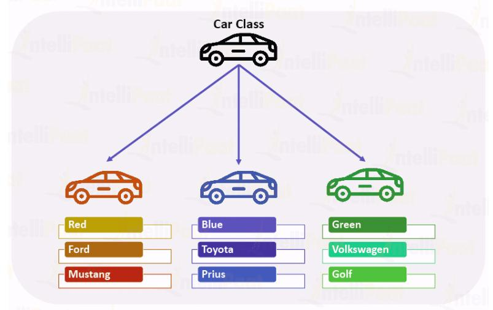
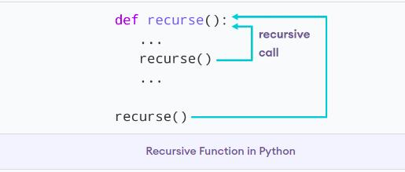

# Reading_Notes
## Code 401 - Advanced Software Development

# Classes and Objects


By [Ghaida Al Momani] (https://github.com/GhaidaMomani).

>>>>>Welcome to Code 401.
<br/>
<hr/>
<br/>


## Python Objects and Classes



**Python is an object-oriented programming language.** Unlike procedure-oriented programming, where the main emphasis is on functions, object-oriented programming stresses on objects.

An **object** is simply a collection of data (variables) and methods (functions) that act on those data. Similarly, a class is a blueprint for that object.

We can think of a class as a sketch (prototype) of a house. It contains all the details about the floors, doors, windows, etc. Based on these descriptions we build the house. House is the object.

As many houses can be made from a house's blueprint, we can create many objects from a class. An object is also called an instance of a class and the process of creating this object is called **instantiation.**


## Defining a Class in Python
Like function definitions begin with the def keyword in Python, class definitions begin with a class keyword.

Here is a simple class definition.

``` py
class MyNewClass:
    '''This is a docstring. I have created a new class'''
    pass
```


As soon as we define a class, a new class object is created with the same name. This class object allows us to access the different attributes as well as to instantiate new objects of that class.

``` py
class Person:
    "This is a person class"
    age = 10

    def greet(self):
        print('Hello')


# Output: 10
print(Person.age)

# Output: <function Person.greet>
print(Person.greet)

# Output: "This is a person class"
print(Person.__doc__)
```


<hr/>
    <p align="right">(<a href="#top">back to top</a>)</p>


## Creating an Object in Python

We can access the attributes of objects using the object name prefix.

Attributes may be data or method. Methods of an object are corresponding functions of that class.

``` py
class Person:
    "This is a person class"
    age = 10

    def greet(self):
        print('Hello')


# create a new object of Person class
harry = Person()
```


<hr/>
    <p align="right">(<a href="#top">back to top</a>)</p>


   


   
## Thinking Recursively in Python


 
 **A recursive function** is a function defined in terms of itself via self-referential expressions.

This means that the function will continue to call itself and repeat its behavior until some condition is met to return a result. All recursive functions share a common structure made up of two parts: base case and recursive case.

``` py
def factorial_recursive(n):
    # Base case: 1! = 1
    if n == 1:
        return 1

    # Recursive case: n! = n * (n-1)!
    else:
        return n * factorial_recursive(n-1)
    
```


<hr/>
    <p align="right">(<a href="#top">back to top</a>)</p>


<br/>

**Naive Recursion is Naive**

The Fibonacci numbers were originally defined by the Italian mathematician Fibonacci in the thirteenth century to model the growth of rabbit populations. Fibonacci surmised that the number of pairs of rabbits born in a given year is equal to the number of pairs of rabbits born in each of the two previous years, starting from one pair of rabbits in the first year.

To count the number of rabbits born in the nth year, he defined the recurrence relation:
```
Fn = Fn-1 + Fn-2
```
The base cases are:
```
F0 = 0 and F1 = 1
```
Let’s write a recursive function to compute the nth Fibonacci number:
``` py
def fibonacci_recursive(n):
    print("Calculating F", "(", n, ")", sep="", end=", ")

    # Base case
    if n == 0:
        return 0
    elif n == 1:
        return 1

    # Recursive case
    else:
        return fibonacci_recursive(n-1) + fibonacci_recursive(n-2)

``` 

 As you can see from the output above, we are unnecessarily recomputing values. Let’s try to improve fibonacci_recursive by caching the results of each Fibonacci computation Fk:
``` py
from functools import lru_cache

@lru_cache(maxsize=None)
def fibonacci_recursive(n):
    print("Calculating F", "(", n, ")", sep="", end=", ")

    # Base case
    if n == 0:
        return 0
    elif n == 1:
        return 1

    # Recursive case
    else:
        return fibonacci_recursive(n-1) + fibonacci_recursive(n-2)
```
<hr/>
    <p align="right">(<a href="#top">back to top</a>)</p>


  <br/><br/>

<p align="right">Ghaida Al Momani, Software Engineer</p>
<p align="right">Jordan, Amman</p>
  <p align="right">22, 05 MAR </p>