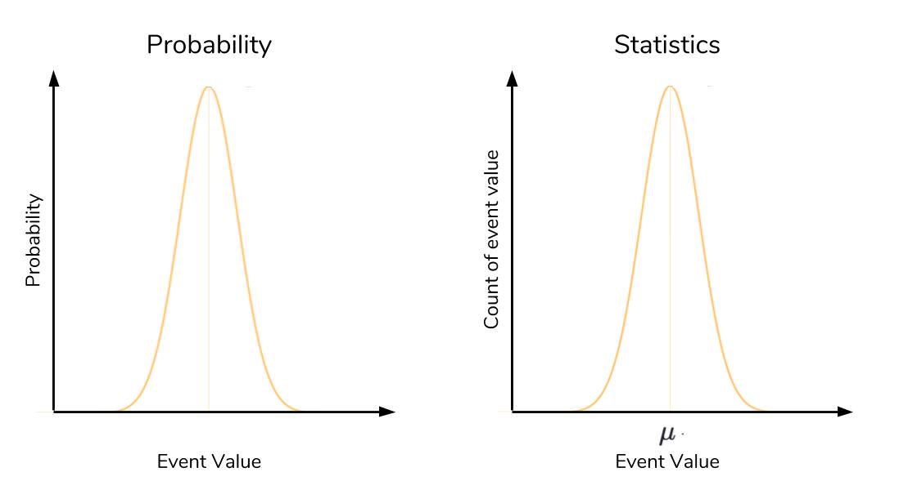

# Reading_Notes
## Code 401 - Advanced Software Development
<!-- This is the reading notes repository where I keep my favorite articles with their sources.
       
       Hope you'll benefit from my reads, Enjoy!
-->


By [Ghaida Al Momani] (https://github.com/GhaidaMomani).

>>>>>Welcome to Code 401.
<br/>
<hr/>
<br/>


# Game of Greed 4, Dunder Methods, Statistics - Probability
## Enriching Your Python Classes With Dunder (Magic, Special) Methods
By [Bob Belderbos](https://dbader.org/blog/python-dunder-methods)

**What Are Dunder Methods?**
In Python, special methods are a set of predefined methods you can use to enrich your classes. They are easy to recognize because they start and end with double underscores, for example __init__ or __str__.

As it quickly became tiresome to say under-under-method-under-under Pythonistas adopted the term “dunder methods”, a short form of “double under.”


These ***“dunders”*** or “special methods” in Python are also sometimes called """“magic methods.”"""


**Example:**
```
class NoLenSupport:
    pass

>>> obj = NoLenSupport()
>>> len(obj)


TypeError: "object of type 'NoLenSupport' has no len()"

```
To fix this, you can add a __len__ dunder method to your class:

```
class LenSupport:
    def __len__(self):
        return 42

>>> obj = LenSupport()
>>> len(obj)
42
```


## Object Initialization: __init__
Right upon starting my class I already need a special method. To construct account objects from the Account class I need a constructor which in Python is the __init__ dunder:
```
class Account:
    """A simple account class"""

    def __init__(self, owner, amount=0):
        """
        This is the constructor that lets us create
        objects from this class
        """
        self.owner = owner
        self.amount = amount
        self._transactions = []

```
The constructor takes care of setting up the object. In this case it receives the owner name, an optional start amount and defines an internal transactions list to keep track of deposits and withdrawals.

This allows us to create new accounts like this:
```
>>> acc = Account('bob')  # default amount = 0
>>> acc = Account('bob', 10)
```
## Object Representation: __str__, __repr__
It’s common practice in Python to provide a string representation of your object for the consumer of your class (a bit like API documentation.) There are two ways to do this using dunder methods:

__repr__: The “official” string representation of an object. This is how you would make an object of the class. The goal of __repr__ is to be unambiguous.

__str__: The “informal” or nicely printable string representation of an object. This is for the enduser.

Let’s implement these two methods on the Account class:
```
class Account:
    # ... (see above)

    def __repr__(self):
        return 'Account({!r}, {!r})'.format(self.owner, self.amount)

    def __str__(self):
        return 'Account of {} with starting amount: {}'.format(
            self.owner, self.amount)
```

##  Iteration: __len__, __getitem__, __reversed__
## Operator Overloading for Comparing Accounts: __eq__, __lt__
##  Operator Overloading for Merging Accounts: __add__
##  Callable Python Objects: __call__
##  Context Manager Support and the With Statement: __enter__, __exit__

<hr/>
<p align="right">(<a href="#top">back to top</a>)</p>


# Tutorial: Basic Statistics in Python — Probability
 By [Christian Pascual](https://www.dataquest.io/blog/basic-statistics-in-python-probability/)
## What is probability?
At the most basic level, probability seeks to answer the question, “What is the chance of an event happening?” An event is some outcome of interest. To calculate the chance of an event happening, we also need to consider all the other events that can occur. 


## The data and the distribution
Before we can tackle the question of “which wine is better than average,” we have to mind the nature of our data. Intuitively, we’d like to use the scores of the wines to compare groups, but there comes a problem: the scores usually fall in a range. How do we compare groups of scores between types of wines and know with some degree of certainty that one is better than the other? Enter the normal distribution. The normal distribution refers to a particularly important phenomenon in the realm of probability and statistics. The normal distribution looks like this:


The most important qualities to notice about the normal distribution is its symmetry and its shape. We’ve been calling it a distribution, but what exactly is being distributed? It depends on the context. In probability, the normal distribution is a particular distribution of the probability across all of the events. The x-axis takes on the values of events we want to know the probability of. The y-axis is the probability associated with each event, from 0 to 1.


Here’s the same picture of the normal distribution, but labelled according to a probability and statistical context:



## Three Sigma Rule
The Three Sigma rule, also known as the empirical rule or 68-95-99.7 rule, is an expression of how many of our observations fall within a certain distance of the mean. Remember that the standard deviation (a.k.a. “sigma”) is the average distance an observation in the data set is from the mean. The Three Sigma rule dictates that given a normal distribution, 68% of your observations will fall between one standard deviation of the mean. 95% will fall within two, and 99.7% will fall within three. A lot of complicated math goes into the derivation of these values, and as such, is out of the scope of this article. The key takeaway is to know that the Three Sigma Rule enables us to know how much data is contained under different intervals of a normal distribution. The picture below is a great summary of what the Three Sigma Rule represents.


  <br/><br/>
<hr>
<p align="right">Ghaida Al Momani, Software Engineer</p>
<p align="right">Jordan, Amman</p>
<p align="right">22, 22 MAR </p>
