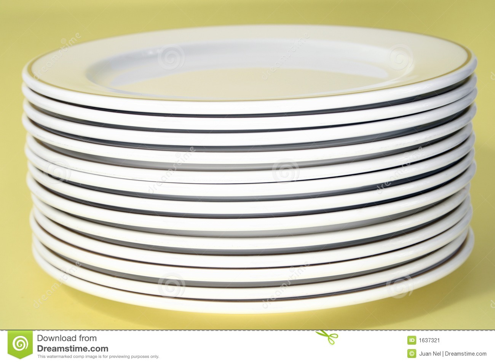
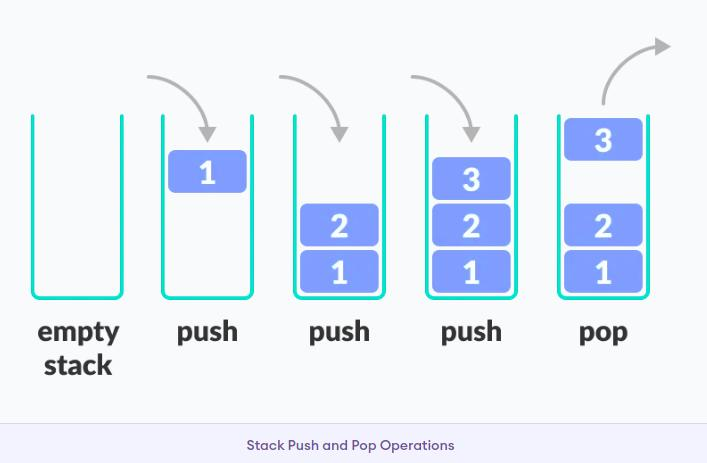
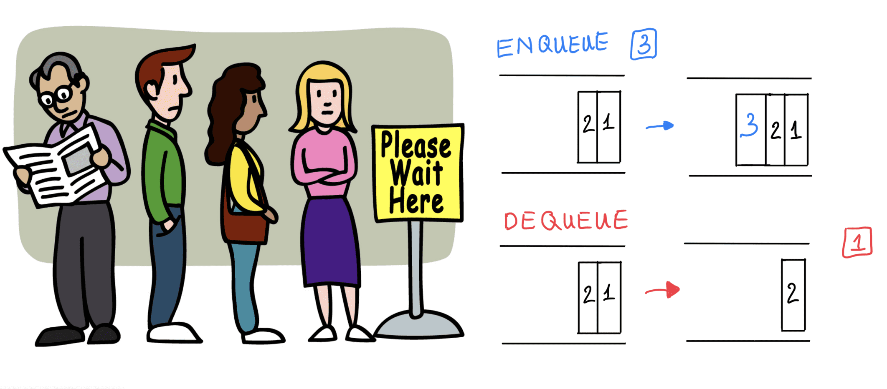

# Reading_Notes
## Code 401 - Advanced Software Development


By [Ghaida Al Momani] (https://github.com/GhaidaMomani).

>>>>>Welcome to Code 401.
<br/>
<hr/>
<br/>


# Stacks and Queues
**What I have learned about stacks and queues** 


## What is a Stack ?
A stack is a data structure that consists of Nodes. Each Node references the next Node in the stack, but does not reference its previous.

***Stack representation similar to a pile of plate :***


Common terminology for a stack is

* Push - Nodes or items that are put into the stack are pushed
* Pop - Nodes or items that are removed from the stack are popped. When you attempt to pop an empty stack an exception will be raised.
* Top - This is the top of the stack.
* Peek - When you peek you will view the value of the top Node in the stack. When you attempt to peek an empty stack an exception will be raised.
* IsEmpty - returns true when stack is empty otherwise returns false.

## Stacks follow these concepts:

**FILO First In Last Out**

**LIFO Principle of Stack**

In programming terms, putting an item on top of the stack is called push and removing an item is called pop.


The Code Demo for slack:
```
class Node :
  def __init__(self,value):
    self.value=value
    self.next=None 

class Stack :
  def __init__(self,node=None):
    self.top = node 

  def push(self,value):
    node = Node(value)
    node.next = self.top
    self.top = node 

  def pop(self) :
    temp = self.top
    self.top = self.top.next
    temp.next= None

    return temp.value

  def peek(self):
    return self.top.value
   
  def is_empty(self):
    """method to check if stack is impty
     return boolean
    """
    return self.top == None 
      return self.top

```


<p align="right">(<a href="#top">back to top</a>)</p>


# What is a Queue
As in real world, this how we manage the queue:

"You have to wait your turn"


Common terminology for a queue is

* Enqueue - Nodes or items that are added to the queue.
* Dequeue - Nodes or items that are removed from the queue. If called when the queue is empty an exception will be raised.
* Front - This is the front/first Node of the queue.
* Rear - This is the rear/last Node of the queue.
* Peek - When you peek you will view the value of the front Node in the queue. If called when the queue is empty an exception will be raised.
* IsEmpty - returns true when queue is empty otherwise returns false.


Queues follow these concepts:

**FIFO First In First Out**

This means that the first item in the queue will be the first item out of the queue.

**LILO Last In Last Out**

```
class Node :
  def __init__(self,value):
    self.value=value
    self.next=None


class Queue :
  def __init__(self):
    self.front=None
    self.rear=None

  def enqueue(self,value):
    node = Node(value)

    if not self.front :
      self.rear = node 
      self.front = node 
      
    else:  
      self.rear.next = node 
      self.rear = node 
      
  def dequeue(self) :
    pass

  def is_empty(self):
    pass

  def peek(self):
    pass

```


<hr/>
<p align="right">(<a href="#top">back to top</a>)</p>


  <br/><br/>

<p align="right">Ghaida Al Momani, Software Engineer</p>
<p align="right">Jordan, Amman</p>
<p align="right">22, 24 MAR </p>