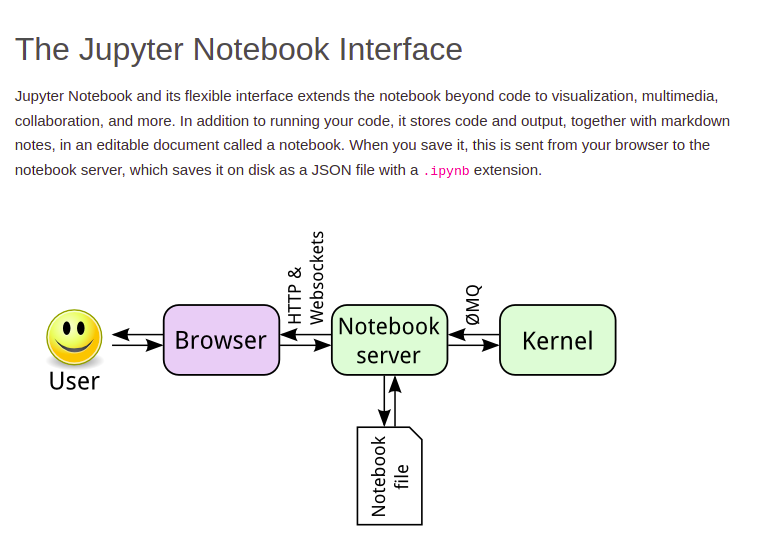

# Reading_Notes
## Code 401 - Advanced Software Development


By [Ghaida Al Momani] (https://github.com/GhaidaMomani).

>>>>>Welcome to Code 401.
<br/>
<hr/>
<br/>


# JupyterLab/ Overview
[Link](https://jupyterlab.readthedocs.io/en/stable/getting_started/overview.html)
**JupyterLab** is a next-generation web-based user interface for Project Jupyter.

JupyterLab enables you to work with documents and activities such as Jupyter notebooks, text editors, terminals, and custom components in a flexible, integrated, and extensible manner. For a demonstration of JupyterLab and its features, you can view this video:

**Before We start take  a look at these two pics in order to get the concept of Jupyter Architecture




[The video of Jupyter](https://www.youtube.com/watch?v=A5YyoCKxEOU)


You can arrange multiple documents and activities side by side in the work area using tabs and splitters. Documents and activities integrate with each other, enabling new workflows for interactive computing, for example:

Code Consoles provide transient scratchpads for running code interactively, with full support for rich output. A code console can be linked to a notebook kernel as a computation log from the notebook, for example.

Kernel-backed documents enable code in any text file (Markdown, Python, R, LaTeX, etc.) to be run interactively in any Jupyter kernel.

Notebook cell outputs can be mirrored into their own tab, side by side with the notebook, enabling simple dashboards with interactive controls backed by a kernel.

Multiple views of documents with different editors or viewers enable live editing of documents reflected in other viewers. For example, it is easy to have live preview of Markdown, Delimiter-separated Values, or Vega/Vega-Lite documents.

JupyterLab also offers a unified model for viewing and handling data formats. JupyterLab understands many file formats (images, CSV, JSON, Markdown, PDF, Vega, Vega-Lite, etc.) and can also display rich kernel output in these formats. See File and Output Formats for more information.

To navigate the user interface, JupyterLab offers customizable keyboard shortcuts and the ability to use key maps from vim, emacs, and Sublime Text in the text editor.

JupyterLab extensions can customize or enhance any part of JupyterLab, including new themes, file editors, and custom components.

JupyterLab is served from the same server and uses the same notebook document format as the classic Jupyter Notebook.

<p align="right">(<a href="#top">back to top</a>)</p>


# NumPy Tutorial: Data Analysis with Python
[By Vik Paruchuri](https://www.dataquest.io/blog/numpy-tutorial-python/)
* NumPy is a Python library.

* NumPy is used for working with arrays.

* NumPy is short for "Numerical Python".


**Let's Take a looka the dimentions of an array :**


***NumPy***  is a commonly used Python data analysis package. By using NumPy, you can speed up your workflow, and interface with other packages in the Python ecosystem, like scikit-learn, that use NumPy under the hood. NumPy was originally developed in the mid 2000s, and arose from an even older package called Numeric. This longevity means that almost every data analysis or machine learning package for Python leverages NumPy in some way.


## Why Use NumPy?
In Python we have lists that serve the purpose of arrays, but they are slow to process.

NumPy aims to provide an array object that is up to 50x faster than traditional Python lists.

The array object in NumPy is called ndarray, it provides a lot of supporting functions that make working with ndarray very easy.

Arrays are very frequently used in data science, where speed and resources are very important.

***Data Science: is a branch of computer science where we study how to store, use and analyze data for deriving information from it.***


## Creating A NumPy Array
We can create a NumPy array using the numpy.array function. If we pass in a list of lists, it will automatically create a NumPy array with the same number of rows and columns. Because we want all of the elements in the array to be float elements for easy computation, we’ll leave off the header row, which contains strings. One of the limitations of NumPy is that all the elements in an array have to be of the same type, so if we include the header row, all the elements in the array will be read in as strings. Because we want to be able to do computations like find the average quality of the wines, we need the elements to all be floats.

In the below code, we:

Import the numpy package.
Pass the list of lists wines into the array function, which converts it into a NumPy array.
Exclude the header row with list slicing.
Specify the keyword argument dtype to make sure each element is converted to a float. We’ll dive more into what the dtype is later on.
```
import csv
with open("winequality-red.csv", 'r') as f:
    wines = list(csv.reader(f, delimiter=";"))
import numpy as np
wines = np.array(wines[1:], dtype=np.float)
```


<p align="right">(<a href="#top">back to top</a>)</p>


<br/><br/>

<p align="right">Ghaida Al Momani, Software Engineer</p>
<p align="right">Jordan, Amman</p>
<p align="right">22, 24 MAR </p>