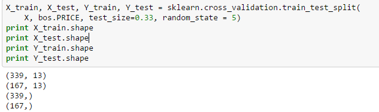

# Reading_Notes
## Code 401 - Advanced Software Development
## Run Linear Regression in Python

By [Ghaida Al Momani] (https://github.com/GhaidaMomani).

>>>>>Welcome to Code 401.
 

 

# How to Run Linear Regression in Python
[By Manu Jeevan](https://bigdata-madesimple.com/how-to-run-linear-regression-in-python-scikit-learn/)

### What Is Regression?

Regression searches for relationships among variables.

For example, you can observe several employees of some company and try to understand how their salaries depend on the features, such as experience, level of education, role, city they work in, and so on.

This is a regression problem where data related to each employee represent one observation. The presumption is that the experience, education, role, and city are the independent features, while the salary depends on them.

here are several ways in which you can do that, you can do linear regression using numpy, scipy, stats model and sckit learn. But in this post I am going to use scikit learn to perform linear regression.

* Generally, in regression analysis, you usually consider some phenomenon of interest and have a number of observations. Each observation has two or more features. Following the assumption that (at least) one of the features depends on the others, you try to establish a relation among them.

In other words, **you need to find a function that maps some features or variables to others sufficiently well.**

### When Do You Need Regression?
Typically, you need regression to answer whether and how some phenomenon influences the other or how several variables are related. 

Regression is also useful when you want to forecast a response using a new set of predictors.

### Linear Regression
Linear regression is probably one of the most important and widely used regression techniques. It’s among the simplest regression methods. One of its main advantages is the ease of interpreting results.

  

(<a href="#top">back to top</a>)

### Scikit-learn 
it is a powerful Python module for machine learning. It contains function for regression, classification, clustering, model selection and dimensionality reduction. Today, I will explore the sklearn.linear_model module which contains “methods intended for regression in which the target value is expected to be a linear combination of the input variables”.

# Linear regression / Example

***Exploring Boston Housing Data Set***

1- The first step is to import the required Python libraries into Ipython Notebook.
2- print the feature names of boston data set.
3- convert boston.data into a pandas data frame.
4- replace column names numbers with the feature names.
5- Add the target prices to the bos data frame.

## Scikit Learn

In this section we are going to fit a linear regression model and predict the Boston housing prices.We  will use the least squares method as the way to estimate the coefficients.

Y = boston housing price(also called “target” data in Python)

and

X = all the other features (or independent variables)

1- First, import linear regression from sci-kit learn module. Then drop the price column as I want only the parameters as my X values.  store linear regression object in a variable called lm.

**Important** functions to keep in mind while fitting a linear regression model are:

* lm.fit() -> fits a linear model

* lm.predict() -> Predict Y using the linear model with estimated coefficients

* lm.score() -> Returns the coefficient of determination (R^2). A measure of how well observed outcomes are replicated by the model, as the proportion of total variation of outcomes explained by the model.

You can also explore the functions inside lm object by pressing lm.

## Fitting a Linear Model
I am going to use all 13 parameters to fit a linear regression model. Two other parameters that you can pass to linear regression object are fit_intercept and normalize.

In [20]: lm.fit(X, bos.PRICE)

Out[20]: LinearRegression(copy_X=True, fit_intercept=True, normalize=False)

I am going to print the intercept and number of coefficients.

As you can see from the data frame that there is a high correlation between RM and prices. Lets plot a scatter plot between True housing prices and True RM.

(<a href="#top">back to top</a>)

# Predicting Prices

We will calculate the predicted prices (Y^i) using lm.predict. Then I display the first 5 housing prices. These are my predicted housing prices.

Now lets see the prices Vs the predicted prices

(<a href="#top">back to top</a>)

# raining and validation data sets
In practice you wont implement linear regression on the entire data set, you will have to split the data sets into training and test data sets. So that you train your model on training data and see how well it performed on test data.

How not to do train-test split:

**train-test split**

You can create training and test data sets manually, but this is not the right way to do, because you may be training your model on less expensive houses and testing on expensive houses.

How to do train-test split:
You have to divide your data sets randomly. Scikit learn provides a function called train_test_split to do this.

Xtrain and Xtest

Let's build a linear regression model using my train-test data sets.

Linear reg

Then  calculate the mean squared error for training and test data.

**Input:**
print “Fit a model X_train, and calculate MSE with Y_train:”, np.mean((Y_train – lm.predict(X_train)) ** 2)

print “Fit a model X_train, and calculate MSE with X_test, Y_test:”, np.mean((Y_test – lm.predict(X_test)) ** 2)

**Output:**
Fit a model X_train, and calculate MSE with Y_train: 19.5467584735 Fit a model X_train, and calculate MSE with X_test, Y_test: 28.5413672756

(<a href="#top">back to top</a>)

  

Ghaida Al Momani, Software Engineer

Jordan, Amman

22, 28 MAR 
