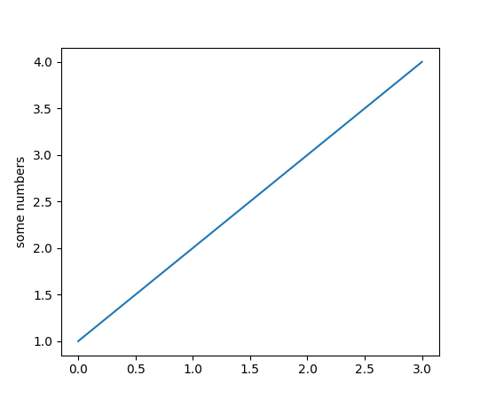
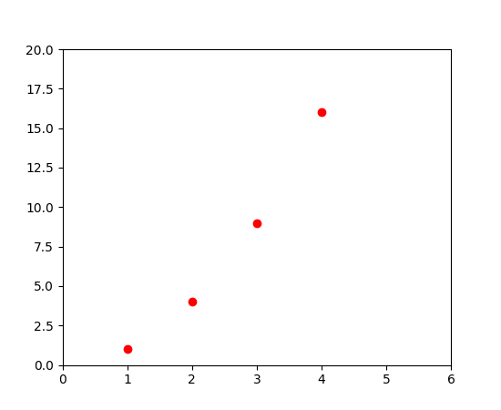
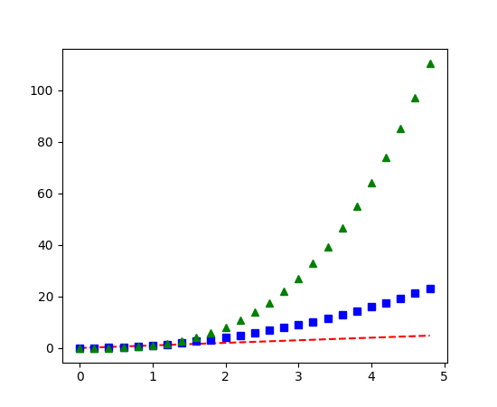

# Reading_Notes
## Code 401 - Advanced Software Development
## Data Visualization


By [Ghaida Al Momani] (https://github.com/GhaidaMomani).

>>>>>Welcome to Code 401.
<br/>
<hr/>
<br/>


[link](https://github.com/rougier/matplotlib-tutorial)


Introduction
============

matplotlib is probably the single most used Python package for 2D-graphics. It
provides both a very quick way to visualize data from Python and
publication-quality figures in many formats.  We are going to explore
matplotlib in interactive mode covering most common cases.

IPython
-------
IPython is an enhanced interactive Python shell that has lots of interesting features including named inputs and outputs, access to shell commands, improved debugging and much more. It allows interactive matplotlib sessions that have Matlab/Mathematica-like functionality.

pyplot
-------
**pyplot** provides a convenient interface to the matplotlib object-oriented plotting library. It is modeled closely after Matlab(TM). Therefore, the majority of plotting commands in pyplot have Matlab(TM) analogs with similar arguments. Important commands are explained with interactive examples.

Simple plot
In this section, we want to draw the cosine and sine functions on the same plot. Starting from the default settings, we'll enrich the figure step by step to make it nicer.

The first step is to get the data for the sine and cosine functions:

``` python
import numpy as np

X = np.linspace(-np.pi, np.pi, 256, endpoint=True)
C, S = np.cos(X), np.sin(X)
X is now a NumPy array with 256 values ranging from -π to +π (included). C is the cosine (256 values) and S is the sine (256 values).
```
To run the example, you can download each of the examples and run it using:

$ python exercice_1.py
You can get source for each step by clicking on the corresponding figure.


# Pyplot tutorial
[Link](https://matplotlib.org/2.0.2/users/pyplot_tutorial.html)

matplotlib.pyplot is a collection of command style functions that make matplotlib work like MATLAB. Each pyplot function makes some change to a figure: e.g., creates a figure, creates a plotting area in a figure, plots some lines in a plotting area, decorates the plot with labels, etc. In matplotlib.pyplot various states are preserved across function calls, so that it keeps track of things like the current figure and plotting area, and the plotting functions are directed to the current axes (please note that “axes” here and in most places in the documentation refers to the axes part of a figure and not the strict mathematical term for more than one axis).


``` pyhton
import matplotlib.pyplot as plt
plt.plot([1,2,3,4])
plt.ylabel('some numbers')
plt.show()
```




ou may be wondering why the x-axis ranges from 0-3 and the y-axis from 1-4. If you provide a single list or array to the plot() command, matplotlib assumes it is a sequence of y values, and automatically generates the x values for you. Since python ranges start with 0, the default x vector has the same length as y but starts with 0. Hence the x data are [0,1,2,3].

plot() is a versatile command, and will take an arbitrary number of arguments. For example, to plot x versus y, you can issue the command:

plt.plot([1, 2, 3, 4], [1, 4, 9, 16])
For every x, y pair of arguments, there is an optional third argument which is the format string that indicates the color and line type of the plot. The letters and symbols of the format string are from MATLAB, and you concatenate a color string with a line style string. The default format string is ‘b-‘, which is a solid blue line. For example, to plot the above with red circles, you would issue
```
import matplotlib.pyplot as plt
plt.plot([1,2,3,4], [1,4,9,16], 'ro')
plt.axis([0, 6, 0, 20])
plt.show()
```


```
import numpy as np
import matplotlib.pyplot as plt

# evenly sampled time at 200ms intervals
t = np.arange(0., 5., 0.2)

# red dashes, blue squares and green triangles
plt.plot(t, t, 'r--', t, t**2, 'bs', t, t**3, 'g^')
plt.show()
```



# Controlling line properties

Lines have many attributes that you can set: linewidth, dash style, antialiased, etc; see matplotlib.lines.Line2D. There are several ways to set line properties

Use keyword args:
``` python
plt.plot(x, y, linewidth=2.0)
Use the setter methods of a Line2D instance. plot returns a list of Line2D objects; e.g., line1, line2 = plot(x1, y1, x2, y2). In the code below we will suppose that we have only one line so that the list returned is of length 1. We use tuple unpacking with line, to get the first element of that list:
```
```python
line, = plt.plot(x, y, '-')
line.set_antialiased(False) # turn off antialising
Use the setp() command. The example below uses a MATLAB-style command to set multiple properties on a list of lines. setp works transparently with a list of objects or a single object. You can either use python keyword arguments or MATLAB-style string/value pairs:
```
``` python
lines = plt.plot(x1, y1, x2, y2)
# use keyword args
plt.setp(lines, color='r', linewidth=2.0)
# or MATLAB style string value pairs
plt.setp(lines, 'color', 'r', 'linewidth', 2.0)
```


<hr/>
    <p align="right">(<a href="#top">back to top</a>)</p>


  <br/><br/>

<p align="right">Ghaida Al Momani, Software Engineer</p>
<p align="right">Jordan, Amman</p>
<p align="right">22, 4 APR </p>