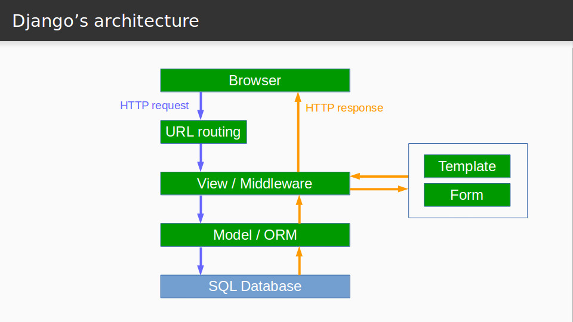
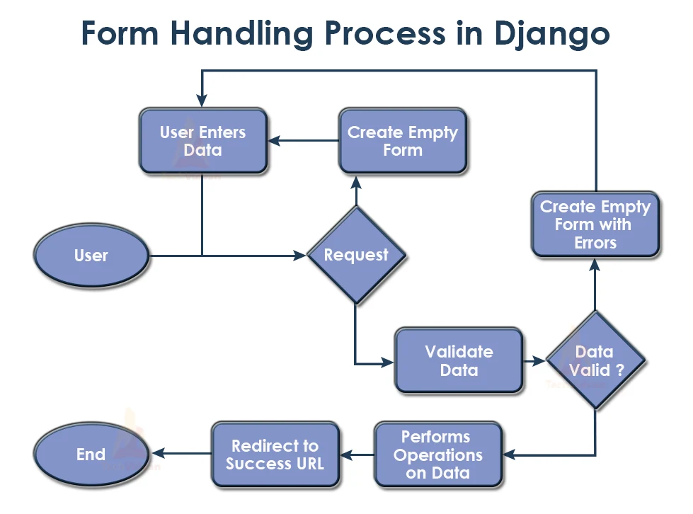

# Reading_Notes
## Code 401 - Advanced Software Development


By [Ghaida Al Momani] (https://github.com/GhaidaMomani).


<br/>
<hr/>
<br/>

# Django CRUD and Forms
* [Link to Article](https://developer.mozilla.org/en-US/docs/Learn/Server-side/Django/Forms)  

## let's take a look on the Django Architecture 




## How forms are handeled in Django




Based on the diagram above, the main things that Django's form handling does are:

Display the default form the first time it is requested by the user.

The form may contain blank fields if you're creating a new record, or it may be pre-populated with initial values (for example, if you are changing a record, or have useful default initial values).

The form is referred to as unbound at this point, because it isn't associated with any user-entered data (though it may have initial values).

Receive data from a submit request and bind it to the form.
Binding data to the form means that the user-entered data and any errors are available when we need to redisplay the form.

Clean and validate the data.

Cleaning the data performs sanitization of the input fields, such as removing invalid characters that might be used to send malicious content to the server, and converts them into consistent Python types.

Validation checks that the values are appropriate for the field (for example, that they are in the right date range, aren't too short or too long, etc.)

If any data is invalid, re-display the form, this time with any user populated values and error messages for the problem fields.

If all data is valid, perform required actions (such as save the data, send an email, return the result of a search, upload a file, and so on).

Once all actions are complete, redirect the user to another page.

Django provides a number of tools and approaches to help you with the tasks detailed above. The most fundamental is the Form class, which simplifies both generation of form HTML and data cleaning/validation. In the next section, we describe how forms work using the practical example of a page to allow librarians to renew books.


<p align="right">(<a href="#top">back to top</a>)</p>


The Django admin site¶
One of the most powerful parts of Django is the automatic admin interface. It reads metadata from your models to provide a quick, model-centric interface where trusted users can manage content on your site. The admin’s recommended use is limited to an organization’s internal management tool. It’s not intended for building your entire front end around.

The admin has many hooks for customization, but beware of trying to use those hooks exclusively. If you need to provide a more process-centric interface that abstracts away the implementation details of database tables and fields, then it’s probably time to write your own views.

In this document we discuss how to activate, use, and customize Django’s admin interface.

Overview¶
The admin is enabled in the default project template used by startproject.

If you’re not using the default project template, here are the requirements:
```
Add 'django.contrib.admin' and its dependencies - django.contrib.auth, django.contrib.contenttypes, django.contrib.messages, and django.contrib.sessions - to your INSTALLED_APPS setting.
Configure a DjangoTemplates backend in your TEMPLATES setting with django.template.context_processors.request, django.contrib.auth.context_processors.auth, and django.contrib.messages.context_processors.messages in the 'context_processors' option of OPTIONS.
If you’ve customized the MIDDLEWARE setting, django.contrib.auth.middleware.AuthenticationMiddleware and django.contrib.messages.middleware.MessageMiddleware must be included.
Hook the admin’s URLs into your URLconf.
```


<hr/>
<p align="right">(<a href="#top">back to top</a>)</p>


<br/><br/>

<p align="right">Ghaida Al Momani, Software Engineer</p>
<p align="right">Jordan, Amman</p>
  <p align="right">22, 11 MAY</p>