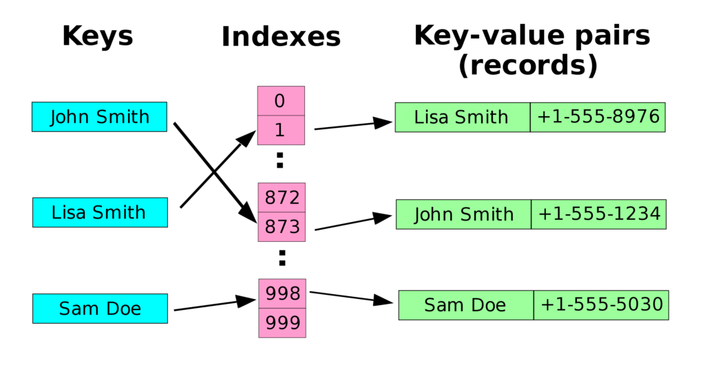
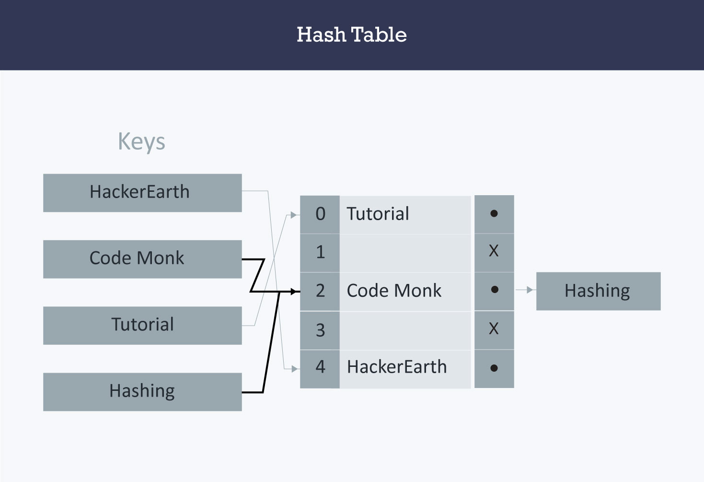

# Reading_Notes
## Code 401 - Advanced Software Development


By [Ghaida Al Momani] (https://github.com/GhaidaMomani).


<br/>
<hr/>
<br/>

# 
Hashtables
* [Link to Article](https://codefellows.github.io/common_curriculum/data_structures_and_algorithms/Code_401/class-30/resources/Hashtables.html)  


## What is a Hashtable?
Terminology:

Hash - A hash is the result of some algorithm taking an incoming string and converting it into a value that could be used for either security or some other purpose. In the case of a hashtable, it is used to determine the index of the array.
Buckets - A bucket is what is contained in each index of the array of the hashtable. Each index is a bucket. An index could potentially contain multiple key/value pairs if a collision occurs.
Collisions - A collision is what happens when more than one key gets hashed to the same location of the hashtable.




## What Are they
Hashtables are a data structure that utilize key value pairs. This means every Node or Bucket has both a key, and a value.

The basic idea of a hashtable is the ability to store the key into this data structure, and quickly retrieve the value. This is done through what we call a hash. A hash is the ability to encode the key that will eventually map to a specific location in the data structure that we can look at directly to retrieve the value.

Since we are able to hash our key and determine the exact location where our value is stored, we can do a lookup in an O(1) time complexity. This is ideal when quick lookups are required.

Example
Let’s say we have data of Seattle neighborhood names and their corresponding zip codes.

``` python

["Greenwood:98103", "Downtown:98101", "Alki Beach:98116", "Bainbridge Island:98110", ...]
```

[Link](https://www.hackerearth.com/practice/data-structures/hash-tables/basics-of-hash-tables/tutorial/)





**Example**
``` python
Declare a dictionary 
dict = {'Name': 'Zara', 'Age': 7, 'Class': 'First'}
```

 Accessing the dictionary with its key

 ``` python
print "dict['Name']: ", dict['Name']
print "dict['Age']: ", dict['Age']
```

Output
When the above code is executed, it produces the following result −

 ``` python
dict['Name']: Zara
dict['Age']: 7
```


<hr/>
<p align="right">(<a href="#top">back to top</a>)</p>


  <br/><br/>

<p align="right">Ghaida Al Momani, Software Engineer</p>
<p align="right">Jordan, Amman</p>
  <p align="right">22, 19 May </p>