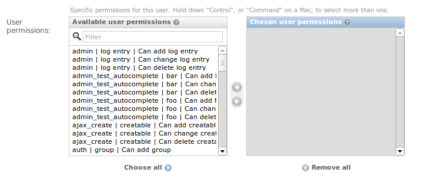

# Reading_Notes
## Code 401 - Advanced Software Development


By [Ghaida Al Momani] (https://github.com/GhaidaMomani).


<br/>
<hr/>
<br/>

# Permissions & Postgresql
[Link to the article](django-rest-framework.org/api-guide/permissions/#permissions)



# Let us first learn about an important term: Authentication


**The Django authentication system handles both authentication and authorization. Briefly, authentication verifies a user is who they claim to be, and authorization determines what an authenticated user is allowed to do. Here the term authentication is used to refer to both tasks.**

**Authentication** is the mechanism of associating an incoming request with a set of identifying credentials, such as the user the request came from, or the token that it was signed with. The permission and throttling policies can then use those credentials to determine if the request should be permitted.

REST framework provides several authentication schemes out of the box, and also allows you to implement custom schemes.

Authentication always runs at the very start of the view, before the permission and throttling checks occur, and before any other code is allowed to proceed.

The request.user property will typically be set to an instance of the contrib.auth package's User class.

The request.auth property is used for any additional authentication information, for example, it may be used to represent an authentication token that the request was signed with.

**Unauthorized and Forbidden responses**
When an unauthenticated request is denied permission there are two different error codes that may be appropriate.
```
HTTP 401 Unauthorized
HTTP 403 Permission Denied
HTTP 401 responses must always include a WWW-Authenticate header, that instructs the client how to authenticate. HTTP 403 responses do not include the WWW-Authenticate header.
```
The kind of response that will be used depends on the authentication scheme. Although multiple authentication schemes may be in use, only one scheme may be used to determine the type of response. The first authentication class set on the view is used when determining the type of response.

<hr/>
<p align="right">(<a href="#top">back to top</a>)</p>

# Permissions
Together with authentication and throttling, permissions determine whether a request should be granted or denied access.

Permission checks are always run at the very start of the view, before any other code is allowed to proceed. Permission checks will typically use the authentication information in the request.user and request.auth properties to determine if the incoming request should be permitted.

Permissions are used to grant or deny access for different classes of users to different parts of the API.

The simplest style of permission would be to allow access to any authenticated user, and deny access to any unauthenticated user. This corresponds to the IsAuthenticated class in REST framework.


## How permissions are determined
Permissions in REST framework are always defined as a list of permission classes.

Before running the main body of the view each permission in the list is checked. If any permission check fails, an exceptions.PermissionDenied or exceptions.NotAuthenticated exception will be raised, and the main body of the view will not run.

When the permission checks fail, either a "403 Forbidden" or a "401 Unauthorized" response will be returned, according to the following rules:
```

The request was successfully authenticated, but permission was denied. — An HTTP 403 Forbidden response will be returned.
The request was not successfully authenticated, and the highest priority authentication class does not use WWW-Authenticate headers. — An HTTP 403 Forbidden response will be returned.
The request was not successfully authenticated, and the highest priority authentication class does use WWW-Authenticate headers. — An HTTP 401 Unauthorized response, with an appropriate WWW-Authenticate header will be returned.
Object level permissions

```
REST framework permissions also support object-level permissioning. Object level permissions are used to determine if a user should be allowed to act on a particular object, which will typically be a model instance.

Object level permissions are run by REST framework's generic views when .get_object() is called. As with view level permissions, an exceptions.PermissionDenied exception will be raised if the user is not allowed to act on the given object.

If you're writing your own views and want to enforce object level permissions, or if you override the get_object method on a generic view, then you'll need to explicitly call the .check_object_permissions(request, obj) method on the view at the point at which you've retrieved the object.

This will either raise a PermissionDenied or NotAuthenticated exception, or simply return if the view has the appropriate permissions.

For example:
```
def get_object(self):
    obj = get_object_or_404(self.get_queryset(), pk=self.kwargs["pk"])
    self.check_object_permissions(self.request, obj)
    return obj

```


<hr/>
<p align="right">(<a href="#top">back to top</a>)</p>


  <br/><br/>

<p align="right">Ghaida Al Momani, Software Engineer</p>
<p align="right">Jordan, Amman</p>
  <p align="right">22, 23 May </p>