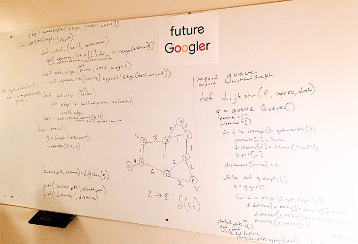

# Reading_Notes
## Code 401 - Advanced Software Development

By [Ghaida Al Momani] (https://github.com/GhaidaMomani).

 

 

# White board interview

## The Best Whiteboard Interview Advice I Ever Received

**The Advice: Communicate!**

**Write Pseudocode and Ask If It Makes Sense**

# 7 tips to ace a programming interview
[Link to the article](https://medium.com/@steve_45636/6-tips-to-ace-a-whiteboard-programming-interview-f06c1b378bc6)

1) Take a few minutes.

2) Write down the steps of the solution.

3) Write pseudocode first.

4) Don’t sweat the small stuff.

5) Sit down. Be humble.

6) Come prepared.

7) Review your work.

(<a href="#top">back to top</a>)

  

Ghaida Al Momani, Software Engineer

Jordan, Amman

22, 6 June 
