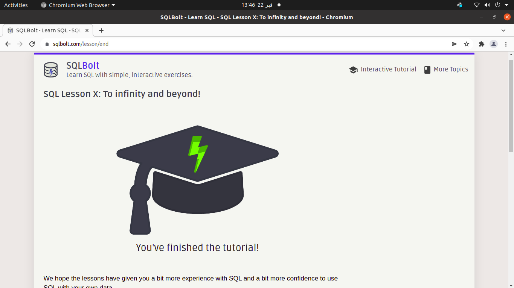

# Reading_Notes

<!-- This is the reading notes repository where I keep my favorite articles with their sources.
       
       Hope you'll benefit from my reads, Enjoy!

-->

By [Ghaida Al Momani] (https://github.com/GhaidaMomani).
 

 

## SQL Practice
**Tasks** 
This prework will introduce you to some of the more common SQL statements and query techniques, allowing you to practice visualizing and querying a relational database.

 

<!-- ROADMAP -->
## Roadmap

- [1] Download the free e-book, Learn SQL, which is an excellent introduction to SQL and relational databases.
     -  Skim the book.
-
- [3]Practice running common SQL commands using the following SQL Bolt tutorials.
    - Lessons 1 through 6 - SQL Queries
    -  Lessons 13 through 18 - Database Management

   

    
(<a href="#top">back to top</a>)

<!-- SQL Bolt Certificate -->
## SQL Bolt Certificate Screenshot

    
(<a href="#top">back to top</a>)

   
## Topics covered :
   

Introduction to SQL  
SQL Lesson 1: SELECT queries 101  
SQL Lesson 2: Queries with constraints (Pt. 1)  
SQL Lesson 3: Queries with constraints (Pt. 2)  
SQL Lesson 4: Filtering and sorting Query results  
SQL Review: Simple SELECT Queries  
SQL Lesson 6: Multi-table queries with JOINs  
SQL Lesson 7: OUTER JOINs  
SQL Lesson 8: A short note on NULLs  
SQL Lesson 9: Queries with expressions  
SQL Lesson 10: Queries with aggregates (Pt. 1)  
SQL Lesson 11: Queries with aggregates (Pt. 2)  
SQL Lesson 12: Order of execution of a Query  
SQL Lesson 13: Inserting rows  
SQL Lesson 14: Updating rows  
SQL Lesson 15: Deleting rows  
SQL Lesson 16: Creating tables  
SQL Lesson 17: Altering tables  
SQL Lesson 18: Dropping tables  
SQL Lesson X: To infinity and beyond!  

 

    
(<a href="#top">back to top</a>)

    

Ghaida Al Momani, Software Engineer

Jordan, Amman

  
22, 22 Feb 
