# Reading_Notes

<!-- This is the reading notes repository where I keep my favorite articles with their sources.
       
       Hope you'll benefit from my reads, Enjoy!


-->


By [Ghaida Al Momani] (https://github.com/GhaidaMomani).
<br/>
<hr/>
<br/>

## SQL Practice
**Tasks** 
This prework will introduce you to some of the more common SQL statements and query techniques, allowing you to practice visualizing and querying a relational database.


<hr/>
<br/>


<!-- ROADMAP -->
## Roadmap

- [1] Download the free e-book, Learn SQL, which is an excellent introduction to SQL and relational databases.
     -  Skim the book.
-
- [3]Practice running common SQL commands using the following SQL Bolt tutorials.
    - Lessons 1 through 6 - SQL Queries
    -  Lessons 13 through 18 - Database Management


   


<hr/>
    <p align="right">(<a href="#top">back to top</a>)</p>


<!-- SQL Bolt Certificate -->
## SQL Bolt Certificate Screenshot


<hr/>
    <p align="right">(<a href="#top">back to top</a>)</p>

   
## Topics covered :
   <p>

Introduction to SQL<br /> 
SQL Lesson 1: SELECT queries 101<br /> 
 * ```SELECT column,another_column,... FROM mytable;```: use this command for selecting a specific columns.
  * ```SELECT * FROM mytable;```: use this command to select all columns.

* SQL Lesson 2: Queries with constraints (Pt. 1)
Select query with constraints
* ``` SELECT column, another_column, … FROM mytable WHERE condition AND/OR another_condition  AND/OR …;```
    <br /> 
* SQL Lesson 3: Queries with constraints (Pt. 2)
<br/>
 ``` Select query with constraints...SELECT column, another_column, … FROM mytable WHERE condition AND/OR another_condition AND/OR …;```
<br/>

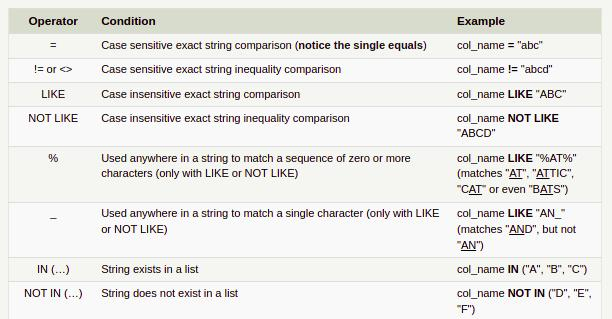

<br /> 
SQL Lesson 4: Filtering and sorting Query results
<br/>
 
 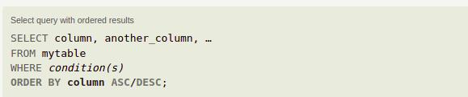
 
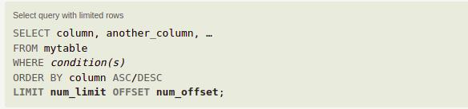
<br /> 
SQL Review: Simple SELECT Queries<br /> 

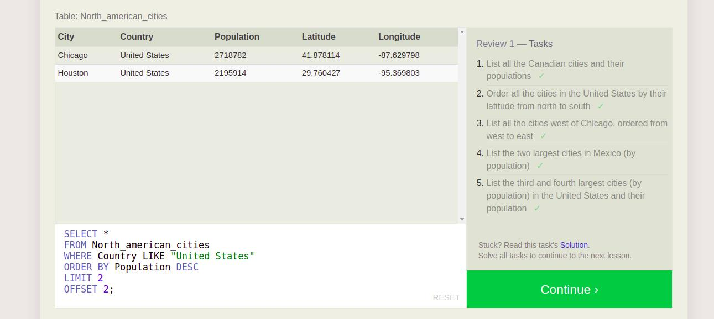

SQL Lesson 6: Multi-table queries with JOINs<br /> 

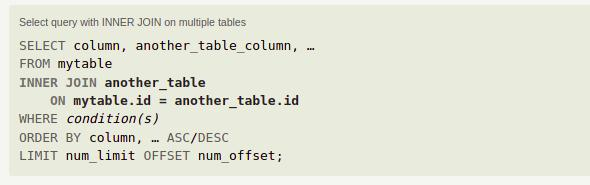

SQL Lesson 7: OUTER JOINs<br /> 
```
Select query with LEFT/RIGHT/FULL JOINs on multiple tables
SELECT column, another_column, …
FROM mytable
INNER/LEFT/RIGHT/FULL JOIN another_table 
    ON mytable.id = another_table.matching_id
WHERE condition(s)
ORDER BY column, … ASC/DESC
LIMIT num_limit OFFSET num_offset;

```
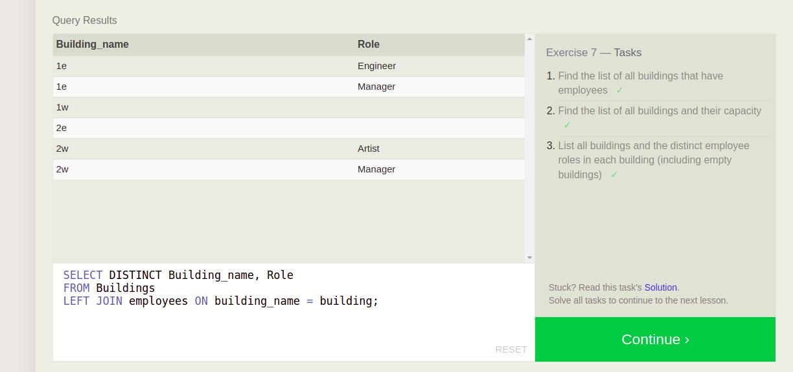
SQL Lesson 8: A short note on NULLs<br /> 
```
Select query with constraints on NULL values
SELECT column, another_column, …
FROM mytable
WHERE column IS/IS NOT NULL
AND/OR another_condition
AND/OR …;
```

SQL Lesson 9: Queries with expressions<br /> 
```
Example query with both column and table name aliases
SELECT column AS better_column_name, …
FROM a_long_widgets_table_name AS mywidgets
INNER JOIN widget_sales
  ON mywidgets.id = widget_sales.widget_id;

```

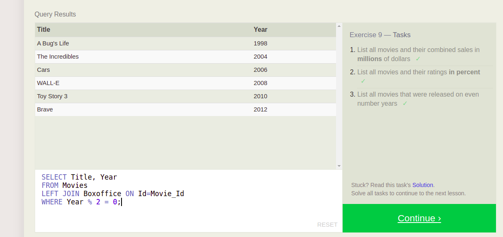
SQL Lesson 10: Queries with aggregates (Pt. 1)
```
Select query with aggregate functions over groups
SELECT AGG_FUNC(column_or_expression) AS aggregate_description, …
FROM mytable
WHERE constraint_expression
GROUP BY column;
```
<br />

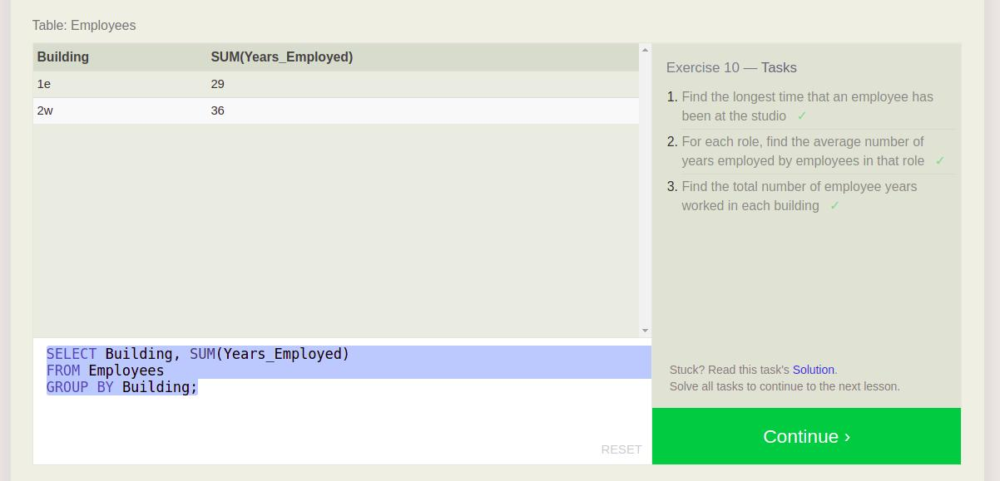
SQL Lesson 11: Queries with aggregates (Pt. 2)
```
Select query with HAVING constraint
SELECT group_by_column, AGG_FUNC(column_expression) AS aggregate_result_alias, …
FROM mytable
WHERE condition
GROUP BY column
HAVING group_condition;
```

<br /> 

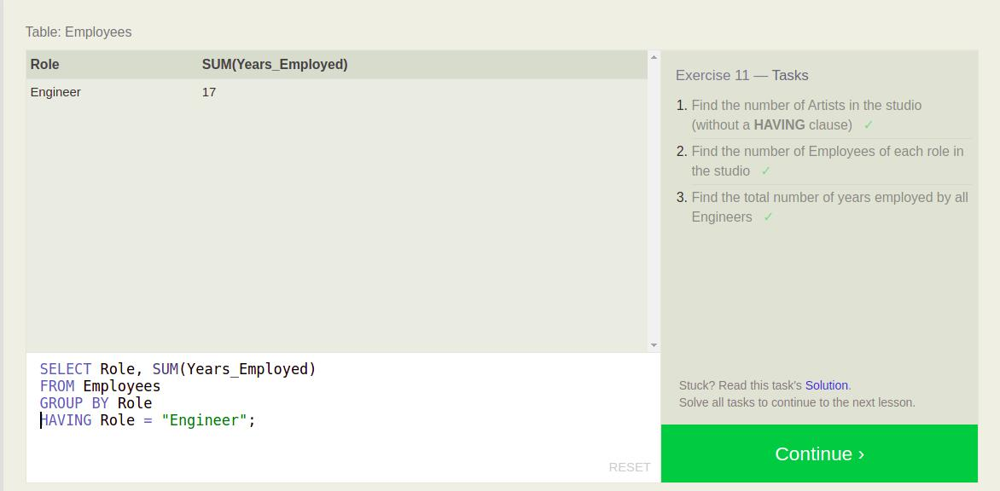

SQL Lesson 12: Order of execution of a Query
<br />

```
Complete SELECT query
SELECT DISTINCT column, AGG_FUNC(column_or_expression), …
FROM mytable
    JOIN another_table
      ON mytable.column = another_table.column
    WHERE constraint_expression
    GROUP BY column
    HAVING constraint_expression
    ORDER BY column ASC/DESC
    LIMIT count OFFSET COUNT;
```
   

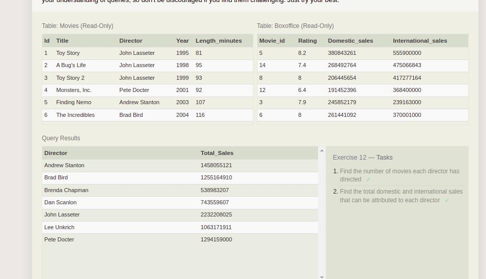 

SQL Lesson 13: Inserting rows<br /> 

```
Insert statement with specific columns
INSERT INTO mytable
(column, another_column, …)
VALUES (value_or_expr, another_value_or_expr, …),
      (value_or_expr_2, another_value_or_expr_2, …),
      …;
```
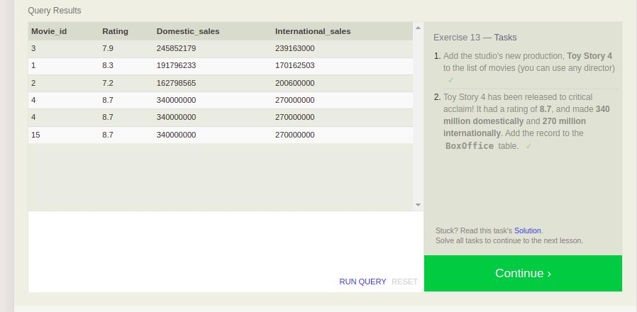

SQL Lesson 14: Updating rows<br /> 
```
Update statement with values
UPDATE mytable
SET column = value_or_expr, 
    other_column = another_value_or_expr, 
    …
WHERE condition;

```

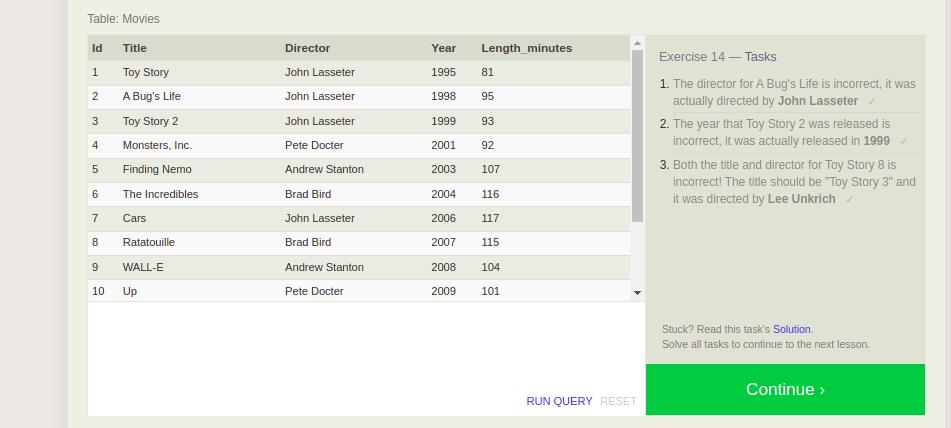

SQL Lesson 15: Deleting rows<br /> 
```
Delete statement with condition
DELETE FROM mytable
WHERE condition;
```
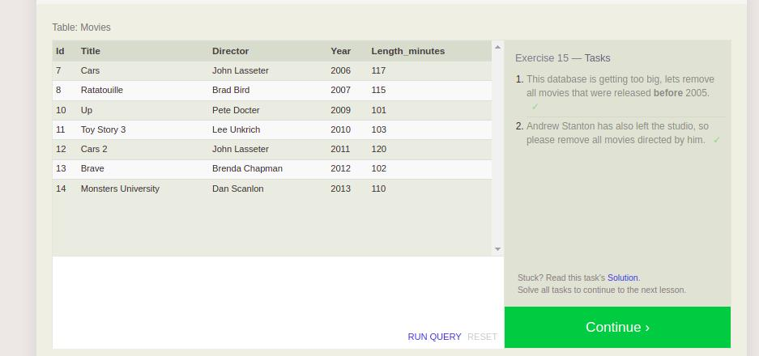


SQL Lesson 16: Creating tables<br /> 
```
Create table statement w/ optional table constraint and default value
CREATE TABLE IF NOT EXISTS mytable (
    column DataType TableConstraint DEFAULT default_value,
    another_column DataType TableConstraint DEFAULT default_value,
    …
);
```


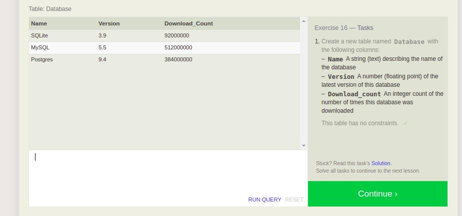

SQL Lesson 17: Altering tables<br /> 

```
Altering table to remove column(s)
ALTER TABLE mytable
DROP column_to_be_deleted;


```

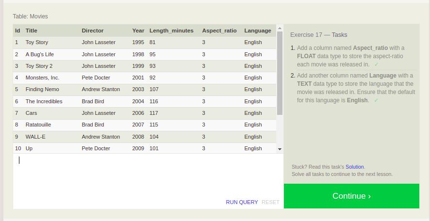
SQL Lesson 18: Dropping tables<br /> 
```
Drop table statement
DROP TABLE IF EXISTS mytable;

```

SQL Lesson X: To infinity and beyond!<br /> 

<p/>

 
<hr/>
    <p align="right">(<a href="#top">back to top</a>)</p>


  <br/><br/>

<p align="right">Ghaida Al Momani, Software Engineer</p>
<p align="right">Jordan, Amman</p>
  <p align="right">22, 22 Feb </p>